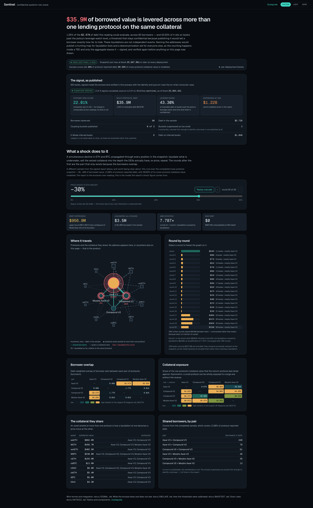

# 🛡️ Sentinel

*A confidential systemic-risk oracle for DeFi lending: it measures the debt that liquidates twice, without ever naming who owes it.*

<video src="https://github.com/LegendaryPenguin/EthOnline/raw/main/docs/demo.mp4" controls width="100%"></video>

[](https://github.com/LegendaryPenguin/EthOnline/raw/main/docs/demo.mp4)
*Click the image above to play the 3:53 demo video (`docs/demo.mp4`), in case GitHub strips the inline player.*

> **Judging or grading this repo? Start at [START-HERE.md](START-HERE.md).** It is a 5 minute path: one command that proves everything, the three prize slots mapped to the exact file that satisfies each, and four files to read in order.

Sentinel measures one number that nobody currently publishes: **how much borrowed value sits with addresses that are levered across more than one lending protocol on the same collateral.** That is the debt that liquidates twice in one price move, and it is where a cascade starts. On live mainnet data on 2026-09-13, at block 25,966,506, the answer was **$35,923,754**, which is 125 bps of the debt this reading could evaluate, held by 1,041 addresses borrowing at 2 protocols, 72 at 3 and 2 at 4, out of 37,862 accounts scanned across 5 protocols.

The measurement is easy to state and unsafe to publish. Getting it requires a per-address map of who is levered where, on what collateral, and at what price shock they go underwater. That map is a pre-sorted queue for liquidation bots and a permanent cross-protocol linkage of otherwise unlinked positions. So Sentinel computes it inside a Chainlink CRE confidential TEE handler and publishes only the aggregate: a score, a multi-protocol share, distressed value, and a count of the buckets it withheld for k-anonymity. The per-address intermediate is computed, used, and destroyed without leaving the enclave.

I built this solo at ETHGlobal ETHOnline 2026. There is no mock mode anywhere in it, and that is enforced rather than promised: `lib/__tests__/no-mock-data.test.ts` fails the build if any product path imports a fixture, if a bare 32-hex API key appears in source, or if `GRAPH_API_KEY` is read outside its one chokepoint. Every figure in this README is reproduced live by `npm run verify`, which last ran 18 stages green in 120.5 seconds.

## ✨ Inspiration

Every lending protocol models its own book carefully and cannot see the one thing that actually breaks it. Aave knows a borrower's health factor on Aave. It does not know that the same address has posted the same weETH at Compound V3 and at Morpho, so a liquidation on Aave moves the price of collateral Compound is also lending against, and Compound's borrowers were never counted in Aave's risk model. Nobody publishes the size of that overlap, because the thing you would have to publish to prove it is the harm itself: a ranked list of levered addresses, which is a hunting map.

That is the deadlock Sentinel breaks. The question is public interest, the input is dangerous, and the two facts have always forced a choice between an unfalsifiable claim and a disclosure. It is newly solvable because two pieces landed independently. First, Messari's standardized subgraph schemas mean `Account.id` is `Bytes!`, the raw address, and it means the same thing in every protocol's subgraph, so the cross-protocol join is a primary-key join rather than heuristic address matching. Second, a confidential compute runtime with a real attested TEE handler means the join can happen somewhere the operator, including me, cannot look.

Neither half is enough alone. Standardized subgraphs without an enclave give you a leverage map you must not publish. An enclave without standardized subgraphs gives you five bespoke adapters and a join you cannot trust. Together they give you a number that is both checkable and safe.

## 🔭 What It Does

A risk desk, a protocol, or a lender that consumes the Sentinel signal gets:

- **The cross-protocol leverage figure itself.** $35,923,754 of borrowed value levered across more than one protocol on the same collateral, 125 bps of evaluable debt, at a named block. The debt no single protocol's risk model counts.
- **A composite systemic risk score**, `systemicRiskScoreBps` = 2201, meaning 22.01 out of 100, published with the explicit caveat that its level is not comparable across months and only its change is.
- **A cascade model with real exit liquidity.** A liquidation that cannot be sold into actual depth is not a liquidation, so the shock ladder propagates through 636 live DEX-depth queries over 159 asset pairs across 4 AMM deployments, deduplicated by `dex:poolId`.
- **Coverage that states what it could not see.** 13.97% of protocol-reported debt sampled, 116 of 360 completed multi-protocol borrowers flagged as resting on an E-Mode reconstruction rather than published risk parameters, and 3 coupling buckets withheld under k-anonymity rather than published as a number that would identify someone.
- **A signal a contract can act on.** 15 aggregate fields, ABI-encoded and signed inside the enclave. `contracts/src/GuardedVault.sol` raises its collateral requirement and pauses new borrowing under alert, checking quorum, staleness, replay and workflow identity first.
- **An agent that can be asked in English and cannot make a number up.** 8 MCP tools plus a SKILL, where every figure arrives with the subgraph it came from and the block it was read at, and the request for the per-address map is refused in the server rather than in a prompt.
- **Zero addresses at any consumer boundary.** `npm run check:ui` proves no 40-hex string crosses the wire on either dashboard route, checked against the 360-account sample.

## 🧱 How I Built It

Four layers, each with a boundary the next one is not allowed to cross.

**The data layer, on The Graph.** `lib/graph/` reads 9 subgraph deployments through the decentralized gateway across two Messari standardized schemas: Lending/CDP for Aave V3, Aave V2, Compound V3, Compound V2 and Morpho Aave V2 (`lib/graph/deployments.ts`), and DEX AMM for Uniswap V3, SushiSwap V2, SushiSwap V3 and Curve (`lib/graph/dex.ts`). One query document in `lib/graph/queries.ts` executes byte-identically against each lending deployment, with a single concession that varies by *schema version* rather than by protocol, because `Position.asset` arrived in 3.x and Compound V2 is still on 2.0.1. `lib/graph/client.ts` is the only place the API key is read, records the block every response was served at, and excludes any deployment more than 1000 blocks behind head with the reason recorded. `lib/graph/snapshot.ts` then reconciles each deployment's summed position debt against the total it reports for itself and rejects the ones that disagree: `aave-v2-eth` is registered on purpose and excluded live at 1925x, because its mappings handle `Borrow` but not `Repay`, and the gate catches that with zero Aave-specific code.

**The confidential aggregation layer, in the Chainlink CRE TEE.** `cre/sentinel-signal/workflow.ts` registers with `cre.handlerInTee`, not `cre.handler`, pinned to AWS Nitro in `us-west-2`. There is no non-TEE path in the workflow. Both secrets, the gateway key and `SENTINEL_RISK_POLICY`, are fetched from the Vault DON inside the enclave and never passed to `usingTheDons()`. The gateway call is made through the TEE runtime via `HTTPClient.sendRequest`, which has a `TeeRuntime` overload where `ConfidentialHTTPClient` does not. `lib/signal/aggregate.ts` builds the per-address leverage map, derives the aggregate from it, applies the k-anonymity floor, and calls `assertAggregateOnly` on its own return value, walking the whole tree to reject any address-shaped value *or key*. `usingTheDons().report(...)` is the single egress call site, which is what makes the field list in `docs/ENCLAVE.md` a complete enumeration rather than a summary.

**The consumer and settlement layer, in Solidity and in viem.** Two deliberately independent consumers with no shared code. `lib/signal/consume.ts` depends on viem only, so reading a Sentinel signal does not require installing the CRE toolchain: it reimplements the 109-byte metadata header at fixed offsets, the `keccak256(keccak256(rawReport) ‖ reportContext)` hash, and an `f + 1` distinct-signer quorum, then adds four checks of its own. `npm run consume-signal` accepts the real recorded payload and refuses 7 of 7 tampered variants. `contracts/src/SentinelConsumer.sol` was written from `docs/SIGNAL.md` alone rather than from the producer's types, and `contracts/src/GuardedVault.sol` acts on the result. 37 forge tests pass, 24 on the consumer and 13 on the vault.

**The AI tooling layer.** `mcp/sentinel-server.mts` exposes 8 tools over MCP, defined in `lib/agent/tools.ts`, with `.claude/skills/sentinel/SKILL.md` describing how to drive them. `lib/agent/context.ts` pins one block per session and answers every question at it, which is a correctness property rather than a cache: two figures read at two blocks cannot be compared. `lib/agent/provenance.ts` enforces the citation invariant by extracting every numeral from a finished answer and requiring it to appear among the cited values, and that check runs in the tools, in the transcript writer, and again in a test that re-parses the committed markdown to catch a hand edit.

**The dashboard and the recorder.** A Next.js app renders the signal only after verifying the signer quorum. The demo video is rendered rather than screen-recorded: `npm run record:render` replays committed terminal casts frame by frame through xterm.js, so any frame can be diffed against the bytes the command actually printed.

## 🛠️ Tech Stack

- **Next.js 16.3.5** and **React 19.2.8** for the dashboard, App Router, dark and light themes from one token build (`npm run tokens`).
- **TypeScript 5** end to end, strict, across the app, the library, the scripts and the CRE workflow.
- **Tailwind CSS 4** with `@tailwindcss/postcss`, driven by generated design tokens.
- **viem 2.56** as the only dependency of the standalone signal consumer.
- **Foundry / Solidity** for `SentinelSignal.sol`, `SentinelConsumer.sol` and `GuardedVault.sol`, tested with `forge test`.
- **The Graph decentralized gateway**, plus **Messari standardized Lending/CDP and DEX AMM subgraphs**, 9 deployments, 2 schemas, 0 per-protocol adapters.
- **Chainlink CRE TypeScript SDK** (`@chainlink/cre-sdk`), `cre.handlerInTee` on AWS Nitro, with the `cre` CLI for simulation. The workflow is a **bun** package with its own lockfile.
- **Model Context Protocol** via `@modelcontextprotocol/sdk` for the 8-tool server, alongside The Graph's own hosted Subgraph MCP for discovery and independent verification.
- **vitest 5** for the TypeScript suites, including the no-mock-mode test and the transcript re-audit.
- **Playwright** for the UI checks and screenshot capture (`npm run check:ui`, `npm run capture:ui`).
- **xterm.js 6** (`@xterm/xterm`) for the video renderer, which replays committed casts rather than a screen recording.
- **tsx** as the runner for every script, **dotenv** for local config, **ESLint 9** with `eslint-config-next`.

## 🔌 How I Use Each Sponsor

Full bullet-by-bullet mapping with line numbers is in [`docs/EVIDENCE.md`](docs/EVIDENCE.md). This is the short version.

### The Graph, "Best Use of Composable or Standardized Graph Products"

| What the track asks | What satisfies it |
|---|---|
| "Either compose two or more of The Graph's products, or build meaningfully on a standardized schema (for example the Messari Standardized Subgraphs)." | Both, and the second is load-bearing. Two Messari schemas treated as one pipeline: Lending/CDP in `lib/graph/deployments.ts`, DEX AMM in `lib/graph/dex.ts`, joined in `lib/cascade/impact.ts` because a liquidation needs risk parameters from one and exit liquidity from the other. |
| "Consume live data from a Graph provider. Mocked, local-only, or static datasets do not qualify." | `lib/graph/client.ts` is the one gateway chokepoint and has no mock path. `lib/__tests__/no-mock-data.test.ts` fails the build if one appears, and it caught a real violation during the build. Run `npm run snapshot`. |
| "Simply querying one Subgraph with no composition or standardization does not qualify." | 9 deployments, 2 schemas, one query document in `lib/graph/queries.ts` executed byte-identically per protocol. |
| "Authoring or extending a Standardized Subgraph is in scope." | **Not claimed.** What I contribute instead is a measurement of where the standard breaks down: `docs/verification/health-reconciliation.md` and `docs/evidence/emode-groups.md`. |
| "Make the standards leverage clear: show what became easier because a shared schema or composed product was used." | `Account.id` is the same `Bytes!` key in every deployment, so the join is a primary-key join. Adding a sixth protocol is one row in `lib/graph/deployments.ts`: no adapter, no query, no mapping code. Aave V2's registration-and-rejection is the proof that claim is load-bearing. Output: `docs/evidence/phase2-cross-protocol.md`. |

### The Graph, "Best AI Tooling or AI Use Case (From Scratch / Start Fresh)"

| What the track asks | What satisfies it |
|---|---|
| "Use The Graph as a load-bearing part of the project." | Every one of the 8 tools answers by querying Messari standardized subgraphs live. `mcp/sentinel-server.mts`, definitions from `lib/agent/tools.ts`. |
| "Consume live data from a Graph provider." | `npm run mcp:handshake` writes `docs/evidence/phase7-mcp-handshake.log`, a real JSON-RPC `initialize` / `tools/list` / `tools/call` exchange showing head 25965980, pinning 25965970, and a signal computed at that block. |
| "Do meaningful work with the data: reasoning, decisions, automation, or a natural-language interface, not just printing a raw query result." | The calibrated alert policy in `lib/agent/alert.ts` decides rather than describes, and its thresholds are copied from the backtest artifact by `npm run alert:derive`, not chosen. `contracts/src/GuardedVault.sol` then acts on the decision on-chain. |
| "Tooling submissions must be reusable infrastructure, not a single end-user app." | An MCP server any client can mount and a `SKILL.md` any Claude Code user can install, neither bound to the dashboard: `claude mcp add sentinel -- npx tsx mcp/sentinel-server.mts`. |
| "Open-source the code with a clear README or SKILL.md so judges can run it." | This file, `.claude/skills/sentinel/SKILL.md`, `docs/AGENT.md`, and `npm run verify` as one command that re-verifies every claim live. |
| "Select the pool that matches how you built." | **Start Fresh (net-new)**, begun and built during the hackathon. Prior-work disclosure in `docs/DISCLOSURE.md`. |

The part I would point a judge at: the tools constrain the model rather than assist it. The SKILL's single rule is that no number may be stated which a tool did not return, spelled out to the point of forbidding rounding, so `$5,720,859,090` may not become "about $5.7 billion", and forbidding derived arithmetic outright. Ask for the per-address leverage map, the actual thing this project computes, and the tools refuse. The refusal lives in the server, so it survives an adversarial user. Transcript with the refusals: `docs/evidence/phase7-transcript.md`.

### Chainlink, "Best Confidential Workflow"

| What the track asks | What satisfies it |
|---|---|
| "Build a CRE Workflow that uses the Confidential Workflows to execute a meaningful part of the application." | `cre/sentinel-signal/workflow.ts`. The confidential part is not *a* part of the application, it is the reason the application can exist. |
| "The workflow must register and use a confidential TEE handler, such as `handlerInTee` in TypeScript." | `cre.handlerInTee(cronTrigger.trigger(...), onCronTrigger, [{ tee: 'nitro', regions: ['us-west-2'] }])`. The handler signature is `(runtime: TeeRuntime<Config>) => string`, and `TeeRuntime` is the only runtime this workflow has. |
| "The confidential portion must process at least one sensitive input, secret, confidential API response, private parameter, or intermediate value inside the enclave." | All five. Secret: the gateway key from the Vault DON. Private parameter: `SENTINEL_RISK_POLICY`, the leverage watch level and score weights. Sensitive input: which borrowers are under evaluation. Confidential API response: raw `Position` rows for 37,862 accounts. Intermediate value: the per-address leverage map, computed and never emitted. Enumerated field by field in `docs/ENCLAVE.md`. |
| "The Confidential Workflow must be meaningfully integrated into the project's core functionality. A placeholder handler or an isolated example will not qualify." | Argued in the negative, which is the strongest form: `npm run leak-demo` prints exactly what the enclave refuses to publish and what an attacker gains if the boundary is removed (`docs/evidence/leak-demo.md`). The k-anonymity floor fires rather than decorating: the recorded report suppresses 3 buckets and publishes 0 instead of a number that would identify someone. |
| "Explicitly control what stays confidential and what leaves the enclave for DON consensus, external delivery, or onchain settlement." | All three destinations are exercised, so each is tested separately: DON consensus, the dashboard as external delivery, and `contracts/src/SentinelSignal.sol` as onchain settlement. 15 fields, one egress call site, contract in `docs/SIGNAL.md`. |
| "Demonstrate a successful execution, and provide evidence of the successful simulation or deployment." | `npm run cre:simulate`, exit 0, transcript at `docs/evidence/cre-simulation.log`, walked bullet by bullet in `docs/CRE-SIMULATION.md`. The CLI's own output confirms the dispatch, "Trigger requested TEE Execution ... AWS Nitro in us-west-2", and that "user logs for this trigger will not be visible, and will not leave the TEE". Result: score 22.0 at block 25966510, 4 protocols, 90 borrowers, 3 buckets suppressed. I am not claiming a live deployment: `cre whoami` reports `Deploy Access: Not enabled`, and the bullet reads simulation **or** deployment. |

## 📚 What I Learned

**Confidentiality is an enumeration problem, not a feature.** I expected the hard part to be getting `handlerInTee` to run. It was not. The hard part was proving that nothing leaks, which meant finding the property that makes an enumeration complete: `usingTheDons()` returns a plain `Runtime` rather than a `TeeRuntime`, so anything handed to it has left the enclave, and that single call site is therefore the whole egress surface. Once I had that, `docs/ENCLAVE.md` could be a checkable list. Before it, I was writing reassurance.

**The guard has to run on the data, not next to it.** My first version called an assertion in `workflow.ts` after aggregating. That is a guard any later edit can forget to call. Moving `assertAggregateOnly` inside `aggregateSignal`, operating on its own return value, is the difference between a policy and an invariant. The same lesson showed up in the address check: I was rejecting address-shaped values and had not thought about *keys*, and a `Record` keyed by account leaks exactly as thoroughly as a list of accounts.

**Diagnostics are the real leak surface.** With `-g`, the CRE engine logs full outbound request URLs, and The Graph's gateway carries the API key as a path segment, so my first raw simulation transcript contained the live key 28 times. The fix is not remembering to redact. `scripts/cre-simulate.mts` redacts in-flight and refuses to write the file at all if any 32-hex token survives, because a process that depends on a human remembering will fail on the night before a deadline.

**Standardized does not mean uniform, and the gap is the interesting part.** Two of the five deployments are wrong in ways the schema cannot express. Aave V2's mappings handle `Borrow` but not `Repay`, so `balance` is lifetime cumulative borrowing and overstates debt by three orders of magnitude. Aave V3's E-Mode is simply absent, which makes 116 of 360 completed multi-protocol borrowers compute as `HF < 1` while being live and un-liquidated, carrying $1,074,472,124 that is my parameters being wrong rather than those borrowers being unsafe. The instinct is to special-case both. The better answer was a general reconciliation gate keyed on an inequality that cannot move (a sample is a subset, so sampled debt cannot exceed protocol-reported debt) and reporting distress as a bound rather than a point estimate. Aave V2 stays in the registry precisely so the gate has something to catch.

**Two figures from two blocks are not comparable, and an agent will mix them.** Pinning one block per session started as a way to cut HTTP calls and turned out to be the only reason the transcripts are trustworthy. An agent re-reading head per tool call reports one score in one paragraph and a different score in the next, and the reader cannot distinguish a real move from a race.

**Constraining a model is more useful than prompting one.** The citation check that catches actual mistakes is not the one inside the tools. It is the test that re-parses the committed transcript markdown and audits every numeral in it, because the failure mode that reaches production is a hand edit, not a tool bug. The carve-out for digits welded to letters (`aave-v3-eth` is not a claim about the number 3) needed a positive-control test asserting that "4 deployments carrying 900 positions" still flags 900, or the exemption quietly widens to every number near a word.

**A signature is not provenance.** The subtle forgery took me longest to understand: the DON signs whatever it runs, so an attacker only needs to deploy *their own* workflow to get a genuine signature on fabricated numbers. A consumer that verifies signatures but not `workflowName` and `workflowOwner` accepts it. Related, and counter-intuitive: ECDSA recovery over the wrong bytes does not fail, it succeeds and returns an unrelated address, so tampering surfaces as `unknown signer` rather than `bad signature`. Pinning the signer set is not optional. I wrote `SentinelConsumer.sol` from `docs/SIGNAL.md` alone rather than from my own types, specifically to find out whether the document was actually sufficient. It was not, twice.

**Publishing the misses is cheaper than defending the hits.** The cold-start flow straddles my own 60 second target and misses it on some runs. The honest claim is "about a minute, dominated by one gateway-bound stage", and writing that down took less time than the paragraph I first drafted explaining why the fast run was the representative one.

## ⚖️ What I Do Not Claim

- **I did not author or extend a standardized subgraph.** I consume two of them, Messari Lending/CDP and Messari DEX AMM.
- **Distress figures are bounds, not point estimates**, because Aave V3 E-Mode is absent from the standardized schema. 116 of 360 completed multi-protocol borrowers compute as `HF < 1` while live and un-liquidated, carrying $1,074,472,124. Every distress number on the dashboard prints its upper bound.
- **The backtest replays 96 of 319 known liquidation episodes**, because only 2 of 5 deployments answer historical time-travel queries. That is stated in the output, not buried.
- **Early warning is a demonstrated direction, not a significance claim.** At the warn operating point, a week-on-week rise of at least 87 bps and a stated 20% false-alarm rate, the signal detects **3 of 5** replayable episodes at a **median 24 hour** lead. At the strictest operating point, alert, at least 239 bps and a stated 10% false-alarm rate, it detects **0 of 5**. An absolute threshold on the score level detects 0 of 5 as well. `n = 5`.
- **`sampleCoverageOfReported` is 13.97%, not 62.66%.** The second is `multiProtocolDebtShareOfSample`, a different quantity, and conflating them would inflate this project by 4.5x. That was a real bug I caught and the dashboard now states the difference in prose.
- **The composite score's level is not comparable across months**, only its change. Both the UI caption and `docs/SIGNAL.md` say so.
- **No Nitro attestation has been verified end to end.** The CRE CLI simulation passes and the workflow is not deployed, so the local harness says `attestation NONE, this is not a TEE` in its own header.
- **The signatures in `consume-signal` are throwaway dev keys**, because a DON cannot sign a report for an undeployed workflow. The payload, wire format, hash construction, quorum rule and every check are real. Substituting the registry-published signer set is a config change, not a code change.

## 🚀 Setup

**Prerequisites.** Node 24 with npm. A **Graph API key** from [thegraph.com/studio](https://thegraph.com/studio), which is the only credential needed for the core path. Three toolchains are not vendored and each is optional: **bun** for the CRE workflow package (it has its own lockfile, so `npm install` does not reach it and the `cre:*` scripts install it themselves), **forge** from Foundry for the Solidity consumers, and the **cre** CLI for the TEE simulation. Only bun is blocking; the other two gate stages that skip with a printed reason.

1. **Clone and install.**
   ```sh
   git clone https://github.com/LegendaryPenguin/EthOnline.git
   cd EthOnline
   npm ci
   ```
2. **Configure.** Copy the template and fill in the two documented values.
   ```sh
   cp .env.example .env.local
   ```
   Set `GRAPH_API_KEY` to your gateway key. `SENTINEL_RISK_POLICY` is documented in the same file: it holds the shock ladder, per-asset betas, the k-anonymity threshold, the score weights and the E-Mode groups, and it is treated as a secret because the thresholds tell an attacker where the published signal stops resolving.
3. **Check your setup before anything runs.**
   ```sh
   npm run preflight
   ```
   This tells you whether your machine can produce real numbers: the key works, the deployments are within sync lag, and the named toolchains are present or explicitly absent.
4. **Verify every claim in this README, live.**
   ```sh
   npm run verify
   ```
   18 stages, no mocks, 120.5 seconds on the last full run. Add `-- --fast` to skip the two slowest stages, which the summary then says out loud so a fast run cannot be mistaken for a full one.
5. **Run the dashboard.**
   ```sh
   npm run dev
   ```
   Then open `http://localhost:3000`. The design system and tokens are at `/styleguide`.
6. **Run the Solidity consumers.**
   ```sh
   cd contracts && forge test -vv
   ```
   37 tests: 24 on `SentinelConsumer.sol`, 13 on `GuardedVault.sol`. Equivalent to `npm run forge:test` from the repo root.
7. **Run the confidential workflow through Chainlink's simulator.**
   ```sh
   npm run cre:typecheck    # compiles against the real CRE SDK
   npm run cre:test         # aggregation, k-anonymity suppression, signing
   npm run cre:simulate     # compiles to WASM, runs the CRE CLI simulator
   ```
   `cre:simulate` took 14.7 seconds here and 148.4 seconds on a cold Go build cache; that range is the toolchain's. It skips cleanly with a printed reason on any machine without CRE credentials, and it refuses to write its transcript at all if a 32-hex token survives redaction.
8. **Useful individual steps.**
   ```sh
   npm run snapshot         # the live cross-protocol read
   npm run cascade          # the shock model, 636 DEX-depth queries
   npm run leak-demo        # what the enclave refuses to publish
   npm run consume-signal   # one accept, seven refusals, against the real payload
   npm run mcp:handshake    # a real MCP client: initialize, tools/list, tools/call
   npm test                 # the vitest suites
   ```

## Docs

| | |
|---|---|
| [`START-HERE.md`](START-HERE.md) | the 5 minute path for a judge or a grading agent |
| [`docs/EVIDENCE.md`](docs/EVIDENCE.md) | every track's qualification bullets mapped to file, line and artifact |
| [`docs/ENCLAVE.md`](docs/ENCLAVE.md) | the confidentiality boundary, field by field, in and out |
| [`docs/SIGNAL.md`](docs/SIGNAL.md) | the integration contract: wire format, fields, verification order |
| [`docs/AGENT.md`](docs/AGENT.md) | the 8 MCP tools and why they constrain the model |
| [`docs/BACKTEST.md`](docs/BACKTEST.md) | recall over replayed liquidations, hits and misses |
| [`docs/CRE-SIMULATION.md`](docs/CRE-SIMULATION.md) | the simulation transcript walked bullet by bullet |
| [`docs/DATAVIZ.md`](docs/DATAVIZ.md) | the design system's rules and the reason for each |
| [`docs/DISCLOSURE.md`](docs/DISCLOSURE.md) | prior-work disclosure, unprompted |
| [`docs/VIDEO.md`](docs/VIDEO.md) | the video script and why it is rendered rather than screen-recorded |
| [`docs/evidence/`](docs/evidence/) | the raw artifacts every claim above is drawn from |

## Tracks

Submitted to three prize slots: The Graph, "Best Use of Composable or Standardized Graph Products". The Graph, "Best AI Tooling or AI Use Case (From Scratch / Start Fresh)". Chainlink, "Best Confidential Workflow".

Built solo at ETHGlobal ETHOnline 2026.
